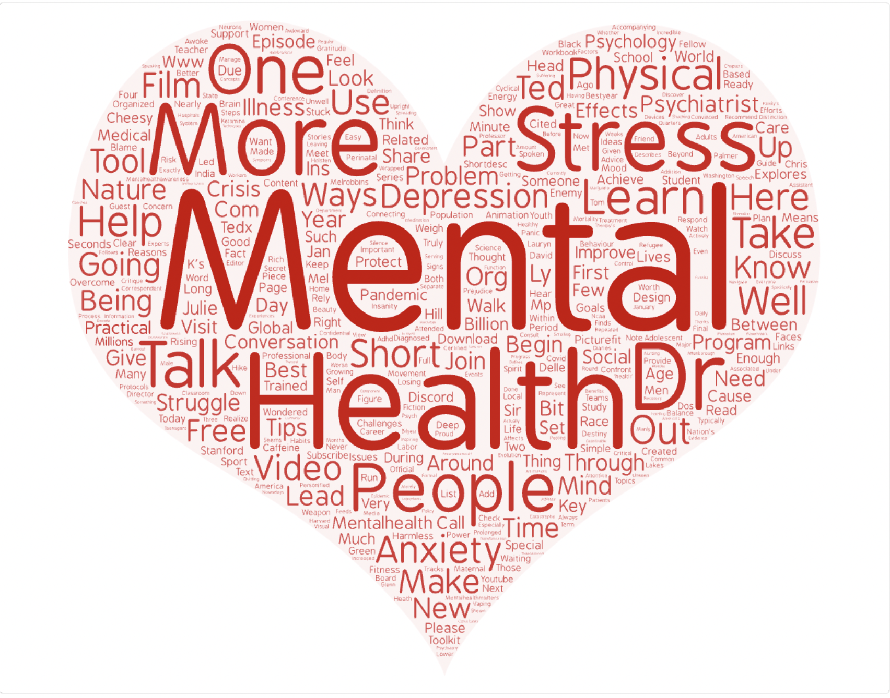
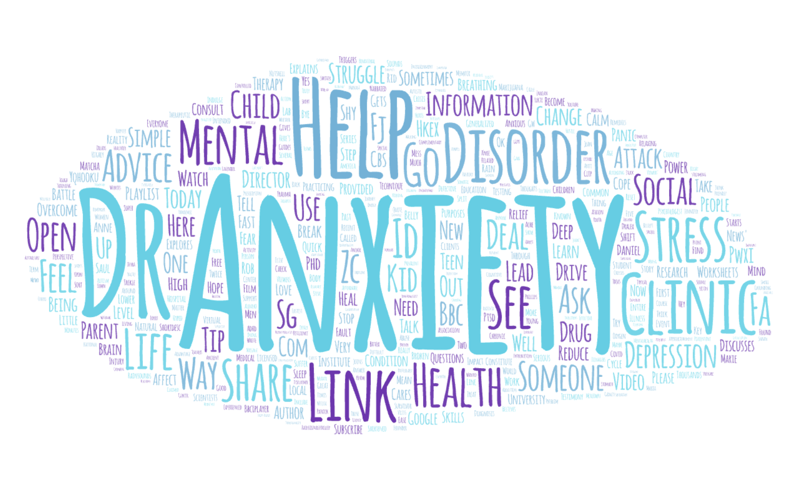
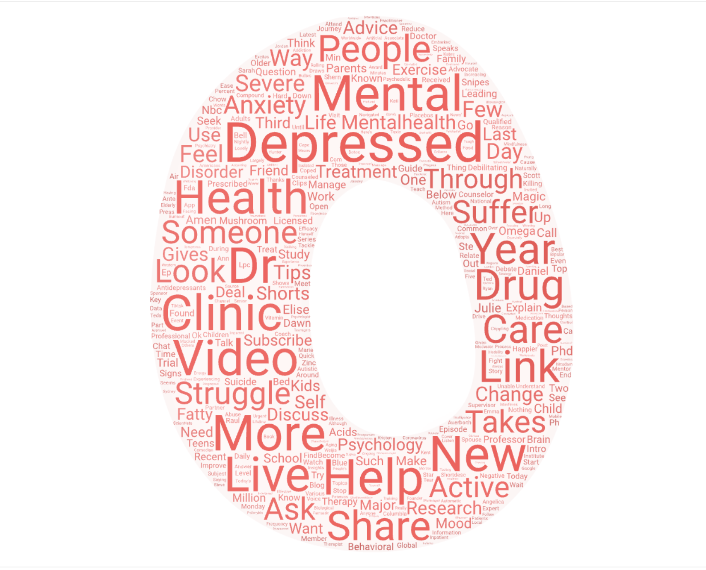

# Web-data-collection-report

## Topic and Search Terms
I choose to look at the topic of mental health, depression and anxiety on Youtube because the rise of mental health problems in our society. Youtube has tons of videos related to mental health, depression, and anxiety because people will come to Youtube to learn about these topics. I thought using these search terms would allow for an interesting comparison because of the similarity of these topics.

## Why I choose this comparison
I thought this comparison would be interesting because each of these mental health problems somewhat relate to each other. I also, wanted to find out if the  search term "mental health" would relate or not relate to "depression" and "axiety" search terms. Furthermore, we can look at the similarity and differences between the search terms "depression" and "axiety". Understanding corrolations between these terms can allow us to see if these videos provide similar information or not.

## Cloud comparison
It seems like there are similar words being used in all three word clouds. They all have about the same 10 words within the first layers. This means there is a strong relationship between these terms. Some of the terms we are commonly seeing in the three word clouds includes,  health, ask, mental, life, video, anxiety, and depression. There are also a lot more similar words throughout the whole world clouds.

## Reasons for observed patterns
The reason we see these patterns when people search these terms on Youtube is because of there relation to mental health and some of the relationship between anxiety and depression. There are significant differences between each term but often times these terms can fit under the same umbrella. I think a lot of the times these words are used in similar conversations and that could be a cause for the patterns we see.

## How could this research could be improved in the future?
Using more data by going threw more Youtube pages could allow for a deeper analysis. Another way to improve this research would be searching more terms that could relate to find other interesting comparisons.

## Any changes with expectation
There were no major changes with what I expected to see. One thing that does stand out is just the fact how many similar terms within the worlds clouds there were.

[Download Results CSV for mental health](assets/anx-help.csv)
[Download Results CSV for axiety](assets/dep-help.csv)
[Download Results CSV for depression](assets/mental.csv)

